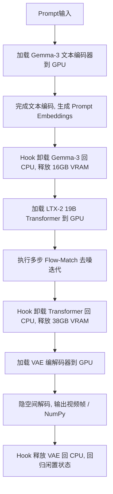

# 💻 LTX-2 19B 运行与性能优化指南 (RTX 3090/4090 24GB)

> **引言**  
> LTX-2 19B 是 VideoAgent 离线超大视频生成管线（19 Billion parameters 蒸馏模型）的核心渲染引擎。由于模型规模庞大，在本地单张 **RTX 3090 / RTX 4090 (24GB VRAM)** 显卡上以极致效率、零 OOM、零卡顿离线运行，需要深度依赖**FP8 量化铸造、CPU 动态离线卸载钩子（Hooks）以及双流渲染机制**。  
> 本文档旨在为开发者与系统运维提供一整套针对 LTX-2 在 24GB 显卡环境下的本地调优机制、硬件陷阱预防与 API 规范。

---

## 一、 硬件限制与本地部署物理基线

LTX-2 19B 蒸馏大模型完整管线包含以下组件：
1. **Gemma-3-8B 文本编码器**：权重大小约 16GB (BF16)。
2. **LTX-2 19B Transformer 主网**：权重大小约 38GB (BF16)。
3. **LTX2 Latent Upsampler (潜空间上采样器)**：权重大小约 6GB。
4. **VAE 编解码器 & Vocoder 声码器**：大容量声影编解码模块。

### 🚨 物理极限限制
如果采用全量 `bfloat16` 精度，仅 Transformer 与文本编码器就需占用超过 **54GB 的显存**。因此，在单张 **24GB 显卡**上，必须通过 **FP8 混合精度层级铸造** 与 **全自动内存复用钩子（Hook）** 才能勉强装载，不允许有任何额外的显存碎片驻留。

---

## 二、 Windows 系统的 VRAM 分页 (WDDM Paging) 致命陷阱

### 2.1 灾难性降速现象
在 Linux 环境下，显存一旦超出物理上限，程序会立即抛出 `CUDA Out of Memory` 错误而终止。然而在 **Windows 操作系统**下，WDDM（Windows Display Driver Model）驱动在物理显存溢出时，并不会抛出 OOM，而是会**自动将超出的显存部分“分页（Page-out）”至系统内存（Shared GPU Memory）**。

> [!WARNING]
> **Windows 分页的灾难性后果：**  
> 系统内存（RAM）在 PCIe 物理总线上的传输带宽（~30-60 GB/s）相比 GPU 的 GDDR6/HBM 显存带宽（~1000 GB/s）低 **10x 至 100x**。一旦触发分页，GPU 会陷入极度缓慢的 PCIe 数据交换等待中：
> - **现象**：系统极度卡顿、鼠标漂移、GPU 核心利用率暴跌。
> - **性能退化**：原本 6.2s/step 的渲染速度可能暴增到 **60s-100s/step**，整体耗时翻数十倍，呈现灾难性退化。

### 2.2 防御与基线保护
1. **清理系统后台**：运行 LTX-2 渲染服务器前，**必须关闭**任何抢占 GPU 物理显存的后台程序：
   - 彻底退出本地运行的大语言模型（如 `Ollama` 后台服务，常驻占用数 GB 至十数 GB 显存）。
   - 关闭 ComfyUI 或 WebUI 本地服务。
   - 关闭开启了硬件加速的高占用浏览器（如 Chrome 多标签页）。
   - **安全闲置基线**：确保 Windows 的基础物理显存占用控制在 **1.5 GB** 以下。
2. **保证管道 Hook 纯净性**：见下文核心优化第三条红线。

---

## 三、 核心优化框架 (The Optimization Pillars)

### 3.1 FP8 Layerwise Casting (层级权重铸造)
为了将 19B 庞大身躯压进显存，在初始化时将 Transformer 主网与上采样网络在**装载层（Layerwise）**强行铸造为 8-bit float 格式，降低权重驻留体积，而在前向计算时以 `bfloat16` 进行动态还原。

* **核心配置代码**：
```python
# 检查是否支持 enable_layerwise_casting
if hasattr(pipe, "transformer") and hasattr(pipe.transformer, "enable_layerwise_casting"):
    pipe.transformer.enable_layerwise_casting(
        storage_dtype=torch.float8_e4m3fn,  # 8位浮点格式，适合大模型权重存储
        compute_dtype=torch.bfloat16        # 计算时还原为 BF16，保持高精度
    )
```

### 3.2 Automatic Model CPU Offload Hooks (自动内存复用)
通过依赖 Diffusers 官方内置的 CPU Offload Hook，实现各模型组件的“时分复用”：

* **核心配置代码**：
```python
pipe.enable_model_cpu_offload(device="cuda")
```

#### 🔄 显存时分复用生命周期


> [!CAUTION]
> **避坑红线 (Critical Bug Fix)：**  
> 严禁在开启了自动 CPU 卸载的 Pipeline 管道中插入任何**手动的组件显存搬运**。例如：
> - ❌ 错误：在推理前手动调用 `pipe.text_encoder.to("cuda")`，或在推理后调用 `pipe.transformer.to("cpu")`。
> - ❌ 错误：手动进行 `pipe.encode_prompt(...)` 随后手动清空 CUDA 缓存。
>
> 手动搬运显存会完全打乱 Diffusers Hook 的内部**引用计数计数器**，导致前向钩子在退出时无法被触发，致使 Gemma 3 文本编码器与 19B Transformer **同时常驻在物理显存中**。这会瞬间突破 24GB 显存大关，强行触发上述的 Windows WDDM Paging 分页灾难。**必须信任并完全交由自动 CPU 卸载钩子控制其生命周期。**

### 3.3 VAE Tiling (隐空间铺砖编解码)
LTX-2 在编解码长视频（如 121 帧，768x512）时，隐空间计算的张量体积极大，在 VAE 解码阶段极易发生瞬时显存崩溃 (OOM)。开启铺砖解码能将庞大的隐空间切分为微小、带重叠的切片，在物理显存上限内分步解码并拼合。

* **核心配置代码**：
```python
pipe.vae.enable_tiling()
```

---

## 四、 Stage 1 草稿双流渲染机制

为了在受控工作流中提供极速反馈，VideoAgent 采用了 **Stage 1 numpy 极速草稿预览机制**。

### 4.1 草稿流 vs 终稿流 性能对比
| 指标 | Stage 1 草稿流 (Draft Preview) | 2-Stage 完整终稿流 (Final Render) |
| :--- | :--- | :--- |
| **步骤设定** | 8 步基础去噪 (`DISTILLED_SIGMA_VALUES`) | Stage 1 (8步) + Upsampler (放大) + Stage 2 (3步精炼) |
| **输出格式** | `"np"` (直接由隐空间解码为 NumPy 像素级帧) | `"latent"` -> 上采样 -> Stage 2 精炼 -> VAE 高清解码 |
| **RTX 3090 耗时** | **约 110.23 秒** (单步去噪迭代仅 ~6.28s) | **数分钟** (视上采样尺度与精炼步数而定) |
| **首选用途** | 时空动态确认、基本镜头构图、人物动态验证 (HITL 审批) | 细节质检合格、成片输出与自动化多轨合成分发 |

* **草稿流核心调用参数**：
```python
video, audio = pipe(
    prompt=prompt,
    negative_prompt=negative_prompt,
    width=768,
    height=512,
    num_frames=121,
    frame_rate=24.0,
    num_inference_steps=8,
    sigmas=DISTILLED_SIGMA_VALUES,
    guidance_scale=1.0,
    output_type="np",       # 关键：直接解码至 numpy，避开隐空间多阶段管道
    return_dict=False,
)
```

---

## 五、 FastAPI 本地微服务部署与存储解耦规范

为了将重算力渲染引擎与 Next.js 前端/LangGraph 状态机解耦，系统将渲染逻辑封装在 `agent/serve_ltx2.py` 的 FastAPI 微服务中，并提供内置的**静态存储分发能力**以支持跨服务器物理隔离部署。

### 5.1 存储与双态分发机制
1. **多态存储驱动 (storage.py)**：服务器通过 `get_storage_client()` 动态加载存储客户端。支持 `LocalStorageClient`（默认本地挂载）与 `S3StorageClient`（本地/云端 S3 对象存储，如 MinIO）。
2. **本地虚拟挂载 (LocalStorage)**：在未启用 S3 或 S3 离线时，服务器自动在根目录创建 `outputs/` 本地物理文件夹，并将其挂载在 `/outputs` 虚拟路由下，向局域网或公网直接暴露静态媒体资源：
   ```python
   app.mount("/outputs", StaticFiles(directory="outputs"), name="outputs")
   ```
3. **S3/MinIO 对象存储分发 (S3Storage)**：若启用 S3 驱动，生成的文件先暂存在本地，然后通过 `boto3` 客户端上传至本地/云端 MinIO 存储桶中，并在上传时利用 `mimetypes` 精准写入 Content-Type 头（例如 `video/mp4` 或 `image/png`），从而使浏览器能够直接进行流式播放和直接渲染，避免成为强制下载资源。
4. **并发覆盖防护**：API 自动丢弃不安全的用户命名，统一采用 `uuid.uuid4()` 分配唯一物理文件名，确保多用户/多 Graph 实例并发请求时资产不发生交叉覆盖。
5. **动态网络 URL 拼接**：
   - 采用本地挂载时，根据传入的 Request 动态解析调用端的主机头 (Host) 和网络协议 (Scheme)，将本地物理路径转化为绝对 Web 相对/绝对 URL 返回给前端。
   - 采用 S3 存储时，直接通过 S3 的 endpoint（如 `http://localhost:9000/video-studio/<uuid>.mp4`）或设定的 `STORAGE_S3_PUBLIC_URL` 返回高可用的免签公网直链（因存储桶已配置为 anonymous download 权限），彻底避免前后端分布式部署时，前端因物理隔离无法读取本地文件的痛点。

### 5.2 运行与健康自检
* **默认端口**：`8125`
* **启动指令 (PowerShell)**：
```powershell
$env:LTX2_PORT="8125"
agent\.venv\Scripts\python.exe agent\serve_ltx2.py
```
* **健康检查 GET API `/health` 自检命令**：
```powershell
Invoke-RestMethod -Uri "http://localhost:8125/health" -Method Get
```
* **正确返回结果**：
```json
{
  "status": "ok",
  "model_loaded": true
}
```

### 5.3 渲染调度 POST API `/generate` Schema
客户端通过向 `/generate` 发送 JSON 负载触发双流视频渲染。

* **接口请求参数 (Pydantic Model)**：
```json
{
  "prompt": "A beautiful sunset over the ocean, 4k",
  "negative_prompt": "shaky, low quality, static...",
  "width": 768,
  "height": 512,
  "num_frames": 121,
  "frame_rate": 24.0,
  "num_inference_steps_stage1": 8,
  "num_inference_steps_stage2": 3,
  "guidance_scale_stage1": 1.0,
  "guidance_scale_stage2": 1.0,
  "seed": 42,
  "output_path": null,  // 设为 null，允许服务端使用 uuid4() 安全自动分配文件名
  "stage1_only": true
}
```

* **接口响应参数 (Response Body)**：
```json
{
  "status": "success",
  "elapsed_seconds": 110.23,
  "output_path": "outputs/a8f3b9d0-c3d5-4a12-87ff-43f1b4a921d2.mp4",
  "url": "http://192.168.1.100:8125/outputs/a8f3b9d0-c3d5-4a12-87ff-43f1b4a921d2.mp4" // 前端可直接引用的网络资产 URL
}
```

* **渲染后台自适应机制**：
  当 `stage1_only` 设为 `true` 时，服务内部仅运行 Stage 1 流程，完成 8 步去噪后立即对隐空间进行 VAE tiling numpy 解码并利用 FFmpeg 快速编码为 mp4 返回给调用端，主动触发 VRAM 清理机制，保证服务具备高交互效率与物理稳定性。

### 5.4 本地 MinIO 容器部署与生命周期管理

为了方便开发者一键部署本地 S3 兼容的资产存储服务，我们在项目根目录下提供了容器化编排方案：

1. **一键启动（在项目根目录下运行）**：
   ```powershell
   docker compose up -d
   ```
   这会拉起两个容器：
   - `video-studio-minio`：主 MinIO 存储服务，S3 API 端口为 `9000`，管理后台 Console 端口为 `9001`（默认账号/密码均为 `minioadmin`）。
   - `video-studio-minio-init`：一过性脚本容器，等待主服务就绪后，自动创建 `video-studio` 存储桶，并将其匿名访问策略配置为 `download`（公共下载）。

2. **环境变量配置（在 .env 中进行定义）**：
   ```bash
   STORAGE_BACKEND=s3
   STORAGE_S3_ENDPOINT=http://localhost:9000
   STORAGE_S3_ACCESS_KEY=minioadmin
   STORAGE_S3_SECRET_KEY=minioadmin
   STORAGE_S3_BUCKET=video-studio
   ```

3. **微服务自适应加载与健壮性**：
   当 `STORAGE_BACKEND=s3` 且微服务能够正常连接 MinIO 时，视频/图像生成接口（如 LTX-2 和 Flux Klein）返回的 `url` 将自适应切换为 S3 高可用直链。例如：
   ```json
   {
     "status": "success",
     "elapsed_seconds": 110.23,
     "output_path": "outputs/a8f3b9d0-c3d5-4a12-87ff-43f1b4a921d2.mp4",
     "url": "http://localhost:9000/video-studio/a8f3b9d0-c3d5-4a12-87ff-43f1b4a921d2.mp4"
   }
   ```
   若本地 Docker 未启动或连接超时，服务不会崩溃，而是会安全回退到本地静态挂载方案，输出本地直链 URL：
   ```json
   {
     "status": "success",
     "elapsed_seconds": 110.23,
     "output_path": "outputs/a8f3b9d0-c3d5-4a12-87ff-43f1b4a921d2.mp4",
     "url": "http://localhost:8125/outputs/a8f3b9d0-c3d5-4a12-87ff-43f1b4a921d2.mp4"
   }
   ```

