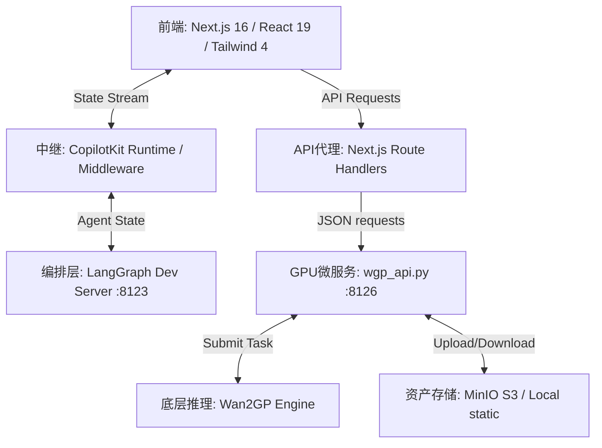

# 🎬 VideoAgent 技术文档与项目核心理念 (v1.5)

本文档系统性地梳理了 **VideoAgent** 项目的技术架构体系、各模块核心实现机制以及贯穿始终的项目设计理念，作为开发与运维的标准化落地指南。

---

## 一、 项目核心理念 (Project Philosophy)

传统的 AI 视频生成大多是“单点式”或“盲盒式”的工具，用户输入 Prompt 后无法进行精细的局部控制与阶段性微调。VideoAgent 的设计初衷是通过 **有状态的工业化协同管线**，将“玩具”升级为真正可用的“生产力工具”。

### 1. 导演-智能体协同 (Director-Agent Synergy)
*   **定位明晰**：用户是唯一的 **导演 (Director)**，负责最高决策、审美把关与最终确认；AI **智能体 (Agent)** 则扮演专业的 **助手/幕僚**，执行具体的剧本拆解、时值计算、预构图规划等重体力工作。
*   **人在回路 (Human-in-the-Loop)**：在关键生产节点（如分镜布局确认、最终视频生成）引入 `interrupt` 机制，强制由导演签字同意后方可向下流转，规避生成失控。

### 2. 工业级可控管线与低成本纠错
*   **阶段解耦**：将视频创作划分为 **Design (创意蓝图)** ➔ **Generation (资产生产)** ➔ **Distribution (分发合成)** 三大阶段。
*   **渐进式演进**：将庞大模糊的目标逐层细化：`剧本 (Script)` ➔ `分镜 (Storyboard)` ➔ `配音 (Voiceover)` ➔ `关键帧 (Keyframes)` ➔ `视频 (Video)` ➔ `导出 (Export)`。每一步都可以在低算力开销下进行确认与重构，最大化减少无效渲染的算力浪费。

---

## 二、 系统分层架构 (Technical Architecture)

项目采用高度解耦的分层设计，确保前端响应速度、后端有状态编排、以及重型 GPU 推理引擎的独立扩展。



### 1. 前端表现层 (Next.js 16 + React 19)
*   **开发技术栈**：Next.js 16 (App Router) + React 19 + TypeScript + TailwindCSS 4 + shadcn/ui。
*   **状态同步**：引入 `CopilotKit v2` 动态维护顶层 `WorkspaceContext`。使用 `@copilotkit/a2ui-renderer` 解析有状态 Agent 返回的结构化指令，实现卡片、图表和布局的动态泛化渲染。

### 2. 后端有状态编排层 (LangGraph)
*   **状态管理**：运行于 `localhost:8123`，使用 `StateGraph` 定义拓扑工作流。
*   **持久化 Checkpoint**：挂载 `PostgresSaver` 数据库作为底座，通过 `projectId` 映射 `thread_id`。所有创意蓝图（剧本、镜头参数、时值约束）均持久化在 Graph 状态中，支持 Undo/Redo 及离线继续创作。

### 3. 本地模型微服务层 (wgp_api.py + Wan2GP)
*   **独立部署**：基于 FastAPI 框架部署的本地统一微服务，运行在 `8126` 端口。它隔离了复杂的深度学习环境与 Next.js Web 环境。
*   **硬件加速推理**：底层对接 **Wan2GP** 推理引擎，集成 **LTX-2 19B** 视频生成、**FLUX.1** 图像生成及 **IndexTTS2** 语音克隆与合成大模型。

---

## 三、 核心管线与落地细节

### 1. 声音与视频时值协同渲染 (Temporal Anchoring)
*   **物理痛点**：传统生成中，画面时值与配音长度不匹配，导致音画不同步。
*   **时值锁定机制**：
    *   在创意阶段的最后一个环节 `/design/voiceover`，系统调用 TTS 服务生成角色配音音频，并回填精准的物理时长（`audio_duration`）。
    *   在 `/generation/video` 视频渲染页面，目标生成帧数自动锁定：
        $$\text{Locked Frames} = \text{round}(\text{audio\_duration} \times \text{frameRate})$$
    *   在渲染端，将生成的音轨与视频直接合流，从源头上杜绝了音画错位。

### 2. 无缝零延迟播放放映厅 (Multi-Video Stacking)
*   **物理痛点**：若在单个 `<video>` 标签上动态切换 `src` 资源，每次 scene 切换时浏览器都会发生黑屏加载和编解码滞后。
*   **解决方案**：
    *   在 `/distribution/theater` 采用 **Multi-Video Stacking** 技术：同时渲染所有生成的场景视频元素。
    *   当前播放的视频使用 `relative z-10 opacity-100`，而非播放视频则使用 `absolute z-0 opacity-0 pointer-events-none` 隐藏。
    *   通过 `preload` 机制在后台预加载当前播放视频的前后相邻场景（`preload={Math.abs(idx - currentSceneIndex) <= 1 ? "auto" : "none"}`）。
    *   单段视频播放结束时，瞬间切换不透明度并触发下一段播放，实现流畅无滞后的连贯大片预览。

### 3. FFmpeg 无损视频拼接引擎 (Lossless Concat Export)
*   **物理痛点**：导出页面原来只能下载单个场景的分段视频，无法合并为成品长片。
*   **解决方案**：
    *   在 `wgp_api.py` 中新增 `/stitch-videos` 接口。
    *   利用本地 `Wan2GP` 目录中高性能的 `ffmpeg_bins/ffmpeg.exe` 提取各分段视频的物理路径。
    *   写入 `concat.txt` 指令文件，使用 FFmpeg **Concat Demuxer** 执行流拷贝合并：
        ```bash
        ffmpeg.exe -y -f concat -safe 0 -i concat.txt -c copy outputs/compilation_xxx.mp4
        ```
    *   使用 `-c copy` 避开了重编码，使得数十兆的视频合并能在 **数毫秒内无损完成**，确保画面质量绝对不下降。

### 4. 跨域安全下载代理 (CORS-Bypassing Download Proxy)
*   **物理痛点**：浏览器直接 fetch 外部 CDN 或不同端口（`8126`）的视频时会产生跨域（CORS）报错；且在异步回调中执行 `window.open` 容易被浏览器弹出拦截器拦截。
*   **解决方案**：
    *   开发 Next.js API `/api/download?url=...` 代理端点，由服务端抓取视频并加上 `Content-Disposition: attachment` 头流式返回给浏览器。
    *   前端构建隐式 `<iframe>` 动态指向代理 URL。这不会开辟新窗口，更不会引起当前工作台页面的重新路由或状态丢失，直接拉起浏览器的文件下载保存框，安全无感。

---

## 四、 生产级工程踩坑红线

1.  **大资产脱离 State**：生成的视频、图片二进制和 Base64 **严禁** 直接塞入 LangGraph `AgentState` 中，以防止数据库 Checkpointer 写入超载。状态中仅能存储对应的直链或 S3 Key 字符串。
2.  **GPU 显存安全（24GB VRAM 红线）**：
    *   **FP8 Quantization**：LTX-2 19B 极大型模型必须以 `float8` 精度装载，在运行时动态转换为 `bfloat16` 计算。
    *   **Model CPU Offload**：严禁在代码中混入任何手动的模型权重移动（如 `.to("cuda")` 或 `.to("cpu")`），这会破坏 Diffusers 内部自动引用计数勾子（hook），导致文本模型和扩散模型同时驻留显存触发 Windows 虚拟显存换出（System RAM paging），引起生成速度发生 100x 级别的断崖式暴跌。
    *   **VAE Tiling**：必须启用 `pipe.vae.enable_tiling()`，避免高分辨率编解码时发生瞬时 VRAM Out-Of-Memory (OOM)。
3.  **下载代理容错**：在 `/api/download` 中，如果服务端 fetch 失败，要配置 fallback 重定向，确保最坏情况下也能在浏览器中打开原链。

---

**更新日期**: 2026-05-28 (v1.5)  
**状态**: 第一个稳定版本已部署上线。打通了“剧本规划 ➔ 音画时值锁定 ➔ 帧对齐渲染 ➔ 零延迟合成预览 ➔ FFmpeg 无损导出”的端到端管线。
