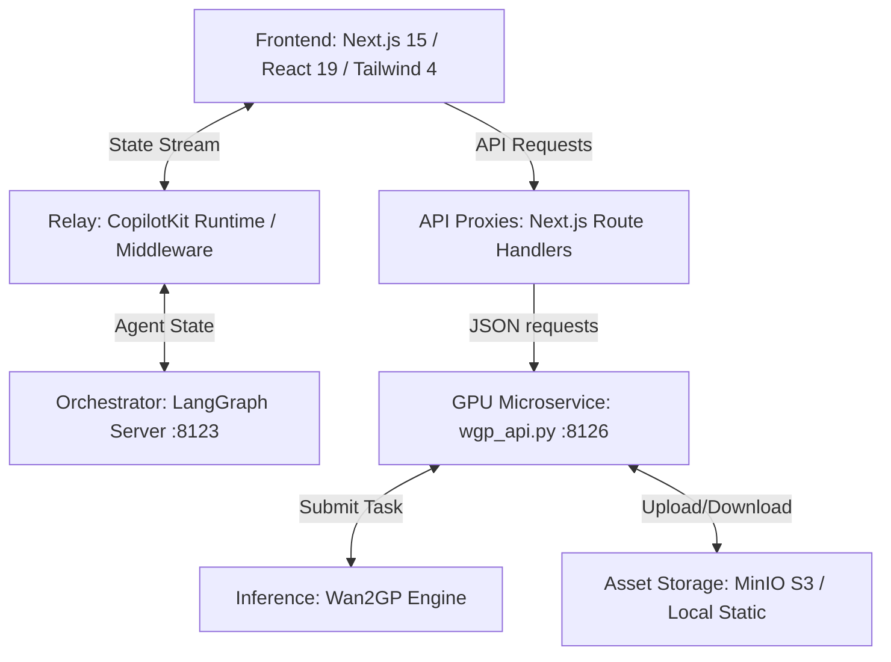

# 🎬 VideoAgent: Industrial-Grade AI Video Generation Workspace

VideoAgent is a stateful, collaborative AI video generation workspace that transitions AI video creation from a "black-box lottery" into a predictable, professional production pipeline. Powered by **LangGraph**, **CopilotKit**, and a suite of advanced local/cloud multimodal models, VideoAgent offers a gradual, cost-controlled, and highly editable video creation experience.

---

## 🏗️ System Architecture

VideoAgent is decoupled into three robust layers: a high-fidelity Web Frontend, a stateful Agent Orchestration Server, and a heavy-duty GPU Inference Microservice.



1.  **Frontend Presentation Layer**: Next.js 15 (App Router) + React 19 + TailwindCSS 4 + shadcn/ui. Binds real-time UI states with the backend Graph State via **CopilotKit v2**.
2.  **Stateful Agent Orchestration Layer**: LangGraph Server with `PostgresSaver` Checkpoint persistence. Ensures that script outlines, character profiles, camera movements, and timing constraints are versioned and queryable (supports time-travel / Undo-Redo).
3.  **Local GPU Inference Layer**: An independent FastAPI microservice running on port `8126`. It isolates the heavy CUDA environment from the web server and schedules tasks across **LTX-2 19B**, **Flux.2-klein**, and **IndexTTS2**.

---

## ✨ Key Capabilities & Pipelines

### 1. Screenplay Breakdown & Character Profiling (Design Node)
*   **Literary Breakdown**: Automatically extracts characters, key props, and scenes from raw screenplay scripts.
*   **Visual Reference Generation**: Uses **Flux.2-klein** to generate high-quality, style-consistent portraits for extracted character entities.

### 2. Cinematic Storyboarding & Spatial Planning (Storyboard Node)
*   **Spatial Bounding Boxes**: Uses a `LayoutGPT` parser to convert descriptive shots into structured coordinates `[x, y, w, h]` for each participant, preventing overlapping and centering biases.
*   **Camera Configuration**: Granularly controls camera focal lengths (e.g. `24mm` wide, `50mm` medium, `85mm` close-up) and movements (`pan`, `tilt`, `zoom-in`, `zoom-out`).

### 3. Voiceover Synthesis & Voice Cloning (Voiceover Node)
*   **Zero-Shot Cloning**: Synthesizes emotional dialogues and narrator voiceovers using **IndexTTS2** via local voice cloning.
*   **Standard Emotion Blends**: Formulates emotions as a combined strength of 8 standard keys (`happy`, `angry`, `sad`, `afraid`, `disgusted`, `melancholic`, `surprised`, `calm`).

### 4. Audio-Visual Timing Alignment (Temporal Anchoring)
*   **Duration Calculation**: The TTS engine physically measures the WAV file length:
    $$\text{Duration (seconds)} = \frac{\text{WAV Samples}}{\text{Sample Rate}}$$
*   **Frame Lock**: Next.js video workbench automatically locks the target frame count for the diffusion model:
    $$\text{Locked Frames} = \text{round}(\text{audio\_duration} \times \text{frameRate})$$
    This guarantees 100% frame-perfect synchronization between voice track and visual duration.

### 5. Multi-Video Stacking (Theater Room)
*   **Seamless Playback**: Combines multiple overlapping `<video>` elements with z-index transitions (`opacity-100` vs `opacity-0`) and adjacent preloading to avoid blank frames or buffering delays during scene switching.

### 6. FFmpeg Lossless Stitching (Export compilation)
*   **Instant Merging**: Uses FFmpeg Concat Demuxer to compile scene clips into a single compilation file without re-encoding:
    ```bash
    ffmpeg.exe -y -f concat -safe 0 -i concat.txt -c copy outputs/compilation.mp4
    ```
    This completes stitching in milliseconds and avoids any quality degradation.

---

## ⚡ Engineering Optimization Specs (VRAM & Storage)

### GPU Memory Management (24GB VRAM Baseline)
*   **FP8 Layerwise Weight Casting**: Casts heavy LTX-2 weights to 8-bit float (`torch.float8_e4m3fn`) during initialization to reduce static footprint, upcasting to `bfloat16` dynamically during the forward pass:
    ```python
    transformer.enable_layerwise_casting(
        storage_dtype=torch.float8_e4m3fn, compute_dtype=torch.bfloat16
    )
    ```
*   **Automatic Model CPU Offload**: Automatically swaps active models (Gemma-3-8B text encoder ➔ LTX-2 19B Transformer ➔ VAE decoder) between GPU VRAM and CPU RAM, keeping active GPU usage under 24GB.
*   **WDDM Paging Protection**: Windows Display Driver Model (WDDM) page-outs trigger massive PCIe latency drops (去噪速度 from `6.2s/step` to `100s/step`). The backend bans manual `.to("cuda")` operations to ensure Diffusers offload hooks work cleanly.
*   **VAE Tiling**: Splits the latent space into overlapping patches (`pipe.vae.enable_tiling()`) to avoid out-of-memory errors during high-resolution, long-frame video decoding.
*   **Stage 1 NumPy Draft Mode**: Introduces an 8-step denoising draft mode (using distilled sigmas) that yields numpy frame arrays directly from the latent decoder in ~110 seconds on RTX 3090, saving hours of unnecessary full-rendering runs.

### Storage & Network Optimization
*   **S3 & MinIO Integration**: Automatically uploads media artifacts to a local MinIO bucket initialized with public read permissions.
*   **MIME-Type Inline Playback**: Dynamically resolves extension formats (e.g. `video/mp4`) to avoid forced browser downloads and allow inline HTML5 video streaming.
*   **Fallback Local Server**: If MinIO is offline, the client seamlessly falls back to local static file serving via FastAPI `StaticFiles`.
*   **CORS-Bypassing Download Proxy**: Proxies external video files through a Next.js endpoint to avoid cross-origin download issues and bypass browser pop-up blockers using a hidden `<iframe>`.

---

## 🛠️ Quick Start Guide

### 1. Run local Storage & MinIO Services
Start the local S3 emulator using Docker Compose:
```bash
docker compose up -d
```
*   MinIO S3 Endpoint: `http://localhost:9000`
*   MinIO Console Admin: `http://localhost:9001` (user/pass: `minioadmin`)

### 2. Configure Environment Variables
Copy `.env.example` to `.env` in both the root folder and the `/agent` directory, and configure:
```env
# Agent Orchestration URL
LANGGRAPH_DEPLOYMENT_URL=http://localhost:8123
AGENT_URL=http://localhost:8123

# Unified GPU Server API URL
WAN2GP_API_URL=http://localhost:8126

# Storage Settings
STORAGE_BACKEND=s3
STORAGE_S3_ENDPOINT=http://localhost:9000
STORAGE_S3_ACCESS_KEY=minioadmin
STORAGE_S3_SECRET_KEY=minioadmin
STORAGE_S3_BUCKET=video-studio
```

### 3. Install Dependencies & Build
Install Next.js dependencies and synchronise python packages via `uv`:
```bash
npm install
```

### 4. Start Development Servers
*   **Start LangGraph Dev Server**:
    ```bash
    npm run dev:agent
    ```
*   **Start Next.js Frontend Server**:
    ```bash
    npm run dev
    ```
*   **Start Local GPU Microservice**:
    ```bash
    npm run dev:wan2gp
    ```

---

## 🛡️ Production & Pipeline Rules
*   **No Raw Binary in Graph State**: Large files (WAV, MP4, PNG) must never be written to the LangGraph state. Store S3/local URLs instead to prevent database Checkpoint bloat.
*   **Strict MCP Boundaries**: All physical actions (file mutations, FFmpeg stitches, ComfyUI calls) must communicate via standard Model Context Protocol (MCP) to ensure separation between inference and execution.
*   **HITL Approvals**: Enforce human-in-the-loop gates after storyboard layouts and voice casting before initiating GPU intensive renders.
